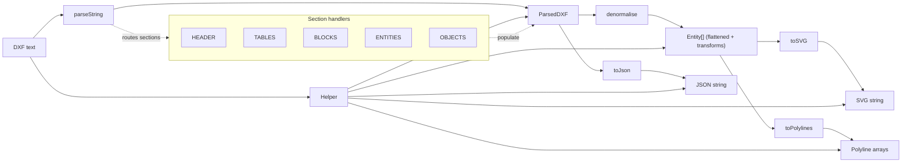

# Architecture

This document describes the high-level architecture of DXF-Renewed, including the parsing pipeline, denormalisation (INSERT expansion), and rendering outputs.

## Goals

- Parse DXF text into a typed model deterministically.
- Expand INSERT/BLOCK references into a flattened entity list with transforms.
- Provide multiple output formats:
  - SVG string (`toSVG`)
  - numeric polylines (`toPolylines`)
  - JSON string (`toJson`)
- Prefer "parse what we can, warn for what we can’t" over throwing, when feasible.

## Project Layout

- `src/` — TypeScript source
  - `src/index.ts` — public API exports
  - `src/Helper.ts` — convenience wrapper around parsing + denormalisation + outputs
  - `src/parseString.ts` — main DXF text parser (routes sections)
  - `src/handlers/` — section handlers and entity handlers
  - `src/types/` — public type definitions
  - `src/denormalise.ts` — INSERT expansion + transform stacking
  - `src/toSVG.ts` — SVG renderer
  - `src/toPolylines.ts` + `src/entityToPolyline.ts` — polyline renderer
  - `src/toJson.ts` — JSON serializer for the parsed model
  - `src/util/` — shared helpers (logger, XML escaping, etc.)
- `test/` — tests and fixtures
  - `test/unit/` — unit tests (Mocha + TSX)
  - `test/integration-browser/` — Playwright browser rendering tests
  - `test/resources/` — DXF fixtures
- `docs/` — documentation and references
- `lib/` and `dist/` — build outputs

## Data Flow (End-to-End)

Typical usage:

1. `parseString(dxfText)` produces a `ParsedDXF` object.
2. `denormalise(parsed)` expands block inserts and returns a flattened `Entity[]`.
3. Render or export:
   - `toSVG(parsed)` renders the denormalised entities into an SVG string.
   - `toPolylines(parsed)` converts supported entities into numeric polyline arrays.
   - `toJson(parsed)` serializes the `ParsedDXF` model into a JSON string.

The `Helper` class wraps this pipeline:

- Constructs from DXF text
- Exposes `parsed` and `denormalised`
- Exposes `toSVG()`, `toPolylines()`, and `toJson()`

### Pipeline Diagram

## Parsing

### Tuple Stream

The parser converts the DXF text into a tuple stream of `[groupCode, value]` and routes it by section.

### Section Routing

`src/parseString.ts` is responsible for splitting tuples into sections and delegating to section handlers:

- `src/handlers/header.ts`
- `src/handlers/tables.ts`
- `src/handlers/blocks.ts`
- `src/handlers/entities.ts`
- `src/handlers/objects.ts`

### Entity Handlers

Entity handlers live in `src/handlers/entity/*.ts` and follow a consistent pattern:

- Export `TYPE` (DXF entity type string).
- Export a `process(tuples)` function that reduces group codes into a typed entity.
- Delegate common fields (layer, color, handle, etc.) to shared parsing helpers.

Multi-entity sequences (e.g. `POLYLINE` → `VERTEX`… → `SEQEND`) are handled by sequencing logic in `src/handlers/entities.ts`.

## Denormalisation (INSERT Expansion)

`src/denormalise.ts` expands `INSERT` entities into the referenced BLOCK contents.

Responsibilities:

- Resolve INSERT → BLOCK.
- Apply transform stacks to expanded entities.
- Expand rectangular arrays when present.

The output is a flat list of entities with an optional `transforms` stack used by renderers.

## Rendering

### SVG (`toSVG`)

`src/toSVG.ts` renders the denormalised entities.

- Uses native SVG primitives when feasible (`<circle>`, `<ellipse>`, path arcs).
- Uses polyline approximations for entities that do not have a native SVG primitive or where approximation is acceptable.
- Unsupported entity types are skipped with a warning.

### Polylines (`toPolylines`)

`src/entityToPolyline.ts` is the main conversion point for entities → polylines.

- Designed to be pure: same input entity should result in the same polyline output.
- Options (e.g., interpolation density) should be expressed via `ToPolylinesOptions`.

### JSON (`toJson`)

`src/toJson.ts` provides a stable way to serialize the parsed model.

- Intended to represent the parsed model 1-to-1.
- Supports pretty-printing via options.

## Logging & Error Handling

- Logging goes through `src/util/logger.ts`.
- Prefer warnings over exceptions for unsupported features.
- Parsing should remain resilient: bad/unknown codes should not crash the entire parse when possible.

## Build & Test

- Build: TypeScript + esbuild bundling.
- Unit tests: Mocha executed with `tsx`.
- Browser integration tests: Playwright (renders fixtures and captures screenshots under `test/rendered/`).
- Functional manual viewer: Vite dev server under `test/functional/`.

