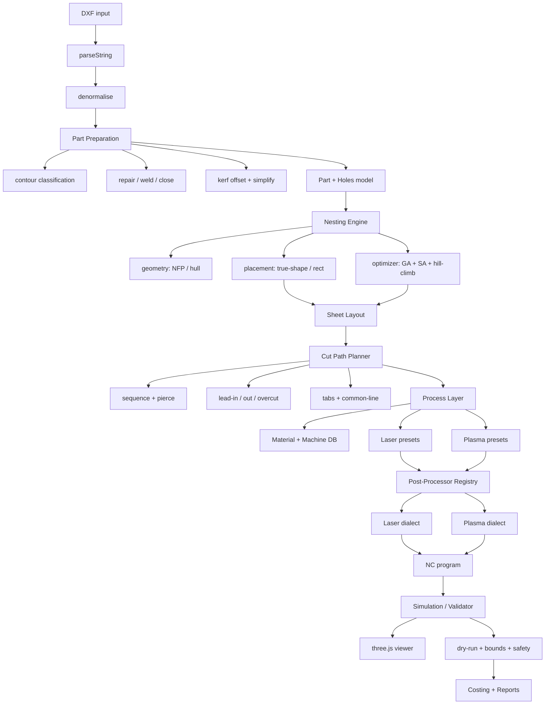

# Nesting + Modular Post-Processor Roadmap (Laser / Plasma)

> Goal: a SigmaNest-class 2D sheet-cutting pipeline — **true-shape nesting**,
> **cut-path planning**, **modular post-processors** for laser and plasma, and a
> **three.js** simulation/viewer — built on top of `DXF-Renewed`.

**Status:** Draft (planning)
**Owner:** LiNkIeZ
**Last updated:** 2026-09-11
**Related:** [`ROADMAP.md`](ROADMAP.md) · [`docs/NESTING-ROADMAP.md`](docs/NESTING-ROADMAP.md) (geometric nesting — implemented)
**Detail docs:** [`docs/nesting/POST-PROCESSORS.md`](docs/nesting/POST-PROCESSORS.md) · [`docs/nesting/TECHNOLOGY-DB.md`](docs/nesting/TECHNOLOGY-DB.md) · [`docs/nesting/VIEWER-THREEJS.md`](docs/nesting/VIEWER-THREEJS.md) · [`docs/nesting/GPU-ACCELERATION.md`](docs/nesting/GPU-ACCELERATION.md)

---

## Table of contents

1. [Research note](#1-research-note)
2. [Scope](#2-scope)
3. [Gap analysis](#3-gap-analysis)
4. [Target architecture](#4-target-architecture)
5. [Module layout](#5-module-layout)
6. [Feature catalogue](#6-feature-catalogue)
7. [Phase roadmap](#7-phase-roadmap)
8. [Workstream A — Geometry engine](#8-workstream-a--geometry-engine)
9. [Workstream B — Cut-path planner](#9-workstream-b--cut-path-planner)
10. [Workstream C — Post-processors](#10-workstream-c--post-processors)
11. [Workstream D — Technology database](#11-workstream-d--technology-database)
12. [Workstream E — three.js viewer](#12-workstream-e--threejs-viewer)
13. [Workstream F — Costing & reports](#13-workstream-f--costing--reports)
14. [Testing strategy](#14-testing-strategy)
15. [KPIs / acceptance metrics](#15-kpis--acceptance-metrics)
16. [Risks & mitigations](#16-risks--mitigations)
17. [Dependencies & licensing](#17-dependencies--licensing)
18. [Open questions `[VERIFY]`](#18-open-questions-verify)

---

## 1. Research note

Web research via Firecrawl returned empty payloads during planning (search returned `0`
results; the agent endpoint returned `404`). This roadmap is therefore grounded on:

1. **Documented feature sets of commercial CAM suites** — SigmaNest (Sigmund/Hexagon),
   Lantek Expert, ProNest by Hypertherm, FastCAM, Burny, Trumpf TruTops, Bystronic BySoft,
   Amada AP100, Mazak, Mitsubishi.
2. **Domain standards** — Hypertherm cut charts (amperage → kerf/feed), laser cut databases
   (material/thickness/gas → speed/focus), ISO 9013 (thermal-cut quality classes),
   RS-274 / ISO 6983 G-code dialects, THC (torch height control) behaviour.
3. **Existing repo code** — `src/nesting/**` (guillotine/maxrects/shelf, SAT collision),
   `src/nest/**` (legacy svg nest).
4. **Open-source prior art** (patterns, not code) — Deepnest, SVGnest, jnest, Nest4J,
   libnest2d, `Clipper2` for offset/boolean.

### Verified product evidence

Firecrawl successfully scraped the official [SigmaNEST product page](https://www.sigmanest.com/en/sigmanest).
It explicitly describes the production workflow as: import CAD parts, automatically sort tasks
by material and machine, optimize material usage and machine motion, post programs to cutting
machines, and track productivity. This roadmap therefore treats material/machine grouping,
motion optimization, NC emission and a serializable job report as first-class requirements.
The self-hosted Firecrawl `search` and `agent` services were unavailable during this research,
so vendor-specific machine codes and cutting parameters remain `[VERIFY]` until validated from
the corresponding controller and power-source manuals.

Every number that depends on a specific machine must be validated against the machine's
manual before shipping. Such items are tagged **`[VERIFY]`** in [§18](#18-open-questions-verify).

---

## 2. Scope

### 2.1 In scope

- Closed-shape extraction, repair, classification (outer / hole / island / open).
- True-shape nesting (NFP) with rectangle fallback, plus a metaheuristic optimizer.
- Automatic optional GPU acceleration for parallel geometry scoring, with deterministic CPU fallback.
- Continuous rotation, part-in-part, common-line cutting.
- Cut-path generation: sequence, pierce, lead-in/out, overcut, tabs/micro-joints.
- Modular post-processors (registry) for **laser** and **plasma** dialects.
- Stateless material/machine technology profiles with kerf & feed lookup.
- Costing (material + cut time + pierce + consumables + labour) and reports.
- three.js 3D simulation, animation, dry-run validation.
- CLI + programmatic API + browser preview.
- ERP-first contract: all machine, material, stock and technology data are caller input; every
  placement, NC program, report and validation result is caller output.

### 2.2 Out of scope

- 3D / tube / profile nesting (separate roadmap).
- Waterjet, router, punching, bevel/3D plasma (framework must allow later addition).
- CAD authoring (we consume DXF; we do not edit drawings).
- Machine closed-loop control (we emit NC programs; we never drive hardware).

---

## 3. Gap analysis

| Capability | Current state | Required |
|---|---|---|
| Shape extraction | `shapeExtractor.ts` closed contours | + open-contour detection, auto-close tolerance, self-intersection repair |
| Hole classification | `isHole` flag | + nesting depth (outer → holes → islands), even-odd parity |
| Collision | SAT (`collision.ts`) | + NFP (no-fit polygon) via Minkowski sum |
| Packing | guillotine / maxrects / shelf | + true-shape packer + optimizer (GA/SA/hill-climb) |
| Acceleration | CPU single-thread | `auto` GPU detection for batch scoring; CPU remains geometry authority |
| Rotation | `allowedRotations` 0/90/180/270 | + continuous rotation for true-shape |
| Sheets | `multiSheetPacker.ts` | + caller-supplied remnant/offcut set, grain lock |
| Cut path | none | sequence, pierce, lead-in/out, overcut, tabs, common-line |
| Kerf | single scalar | per material/thickness lookup from technology DB |
| Post-processor | none | pluggable dialect registry (laser + plasma) |
| Technology params | none | caller-supplied laser + plasma technology profiles |
| Simulation | static SVG (`toNestedSvg`) | three.js animated 3D preview + validator |
| Costing | utilization only | material + time + consumables + labour |
| Reports | none | serializable per-part / per-sheet / per-job artifacts |
| Integration | library + CLI | REST + batch + ERP hooks |

---

## 4. Target architecture



**Golden rule:** the nesting engine never knows the machine; the post-processor never
knows the algorithm. Their only contract is the **Cut Action List** ([§9.1](#91-cut-action-list-contract)).

---

## 5. Module layout

```
src/nesting/
  pro/
    types.ts              # Part, Contour, CutAction, ProcessParams
    partPrep/
      classify.ts         # outer/hole/island/open
      repair.ts           # weld, close gaps, remove self-intersections
      simplify.ts         # Douglas-Peucker, arc fitting
      offset.ts           # kerf compensation (Clipper2)
    geometry/
      nfp.ts              # orbit / Minkowski no-fit polygon
      hull.ts             # convex hull, min-area rect
      nestingDepth.ts     # containment tree
    packer/
      trueShape.ts        # NFP-based placement
      rectPacker.ts       # reuse binPacking/*
      optimizer.ts        # GA / SA / hill-climb
      rotation.ts         # discrete + continuous
      remnant.ts          # offcuts supplied in the job input
    cutpath/
      sequence.ts         # chaining, nearest-neighbour + 2-opt
      pierce.ts           # pierce point selection
      leads.ts            # lead-in / lead-out / overcut
      tabs.ts             # micro-joints / bridges
      commonLine.ts       # shared edges between parts
    tech/
      profiles.ts         # laser + plasma presets supplied by caller
      lookup.ts           # machine+material+thickness → params
    post/
      registry.ts         # PostProcessor interface + registry
      emitters/
        laserGeneric.ts
        plasmaGeneric.ts
        hypertherm.ts
        burny.ts
        farley.ts         # [VERIFY] dialect
      gcode/
        writer.ts         # tokenized G-code builder
      validate.ts         # bounds, feed, rapid sanity
    cost/
      estimate.ts
      report.ts
    viewer/
      scene.ts            # three.js scene + sheet + parts
      animation.ts        # cut-path playback
      controls.ts         # orbit + section view
```

Entry points added to `src/index.ts` (public API):

```ts
export { nestPro } from './nesting/pro'
export { createPostProcessor, listPostProcessors } from './nesting/pro/post/registry'
export { lookupProcessParams } from './nesting/pro/tech/lookup'
export { buildCutActions } from './nesting/pro/cutpath/sequence'
```

---

## 6. Feature catalogue

The complete catalogue is maintained in [`docs/nesting/FEATURE-CATALOGUE.md`](docs/nesting/FEATURE-CATALOGUE.md).
The implementation must cover six surfaces:

1. Geometry preparation: repair, classification, containment, flattening and kerf offset.
2. Nesting: NFP, rotations, optimizer, caller-supplied remnants, part-in-part and common-line cutting.
3. Cut path: pierce, inner-before-outer sequence, leads, overcut, tabs and rapid safety.
4. Post-processing: registry, generic laser/plasma emitters and vendor dialect templates.
5. Simulation: three.js 2D/3D view, animated head, markers, picking and SVG fallback.
6. Production: material database, costing, reports and ERP/MES export.

Tags used in the catalogue: `[L]` laser-specific, `[P]` plasma-specific, `[*]` both.

---

## 7. Phase roadmap

| Phase | Name | Deliverable | Depends on | Status |
|---|---|---|---|---|
| 0 | Foundations | `pro/types.ts`, module scaffold, `nestPro` entry, opts validation | geometric nesting | planned |
| 1 | Part preparation | classify / repair / close / simplify / offset (kerf) | P0 | planned |
| 2 | True-shape geometry | NFP + convex hull + nesting-depth tree | P1 | planned |
| 3 | True-shape packer | `trueShape.ts` + discrete rotation + remnant reuse | P2 | planned |
| 4 | Optimizer | hill-climb → SA → GA, deterministic seed | P3 | planned |
| 4.5 | GPU kernels | optional batch scoring + CPU/GPU equivalence tests | P4 | planned |
| 5 | Cut-path planner | sequence, pierce, leads, overcut, tabs, common-line | P3 | planned |
| 6 | Post-processor core | registry + `PostProcessor` interface + generic laser/plasma | P5 | planned |
| 7 | Vendor dialects | Hypertherm, Burny, Farley templates `[VERIFY]` | P6 | planned |
| 8 | Technology profiles | material/thickness/kerf/feed lookup + stateless presets | P1 | planned |
| 9 | three.js viewer | scene, extrusion, cut-path animation, markers | P5 | planned |
| 10 | Costing & reports | estimate + per-part + job report + ERP export | P8 | planned |
| 11 | Integration | stateless ERP request/response API, batch CLI, browser preview | P6–P10 | planned |
| 12 | Hardening | perf, fuzzing, large-sheet stress, docs | all | planned |

**Milestones**

- **M1 (Phases 0–3):** true-shape nesting produces a valid sheet layout for a real DXF.
- **M2 (Phases 4–6):** one laser and one plasma G-code program emitted and dry-run validated.
- **M3 (Phases 7–9):** vendor dialect + technology DB + animated viewer.
- **M4 (Phases 10–12):** quote/report, API, hardened.

---

## 8. Workstream A — Geometry engine

Scope: `partPrep/*`, `geometry/*`, `packer/*`. Detail: see [`docs/nesting/POST-PROCESSORS.md`](docs/nesting/POST-PROCESSORS.md).

| Task | Acceptance |
|---|---|
| A1 Contour classification | each contour tagged; unclassified count logged |
| A2 Containment tree | even-odd parity correct on nested holes/islands fixture |
| A3 Repair | self-intersections removed; area preserved within 0.1 % |
| A4 Simplify | vertex reduction ≥ 30 % with max deviation ≤ tolerance |
| A5 Kerf offset | offset polygon area matches analytic circle within 0.5 % |
| A6 NFP (Minkowski) | two convex parts produce correct NFP; validated vs. brute force |
| A7 Place­ment | no overlap on 100-part stress fixture (SAT verify) |
| A8 Rotation | continuous sweep, best-angle recorded |
| A9 Optimizer | ≥ 5 % yield gain vs. greedy on benchmark set |
| A10 GPU backend | auto-detect; device error/time-out retries the same batch on CPU |

**Perf targets:** NFP cache hit ≥ 90 %; 500 parts nested < 30 s (single core).
GPU is enabled only when the batch is large enough to overcome transfer cost; details and gates are in [`docs/nesting/GPU-ACCELERATION.md`](docs/nesting/GPU-ACCELERATION.md).

---

## 9. Workstream B — Cut-path planner

### 9.1 Cut Action List (contract)

The single interface between nesting and post-processing:

```ts
export type CutActionKind =
  | 'rapid'      // traverse, torch off
  | 'pierce'     // pierce/dwell at current point
  | 'lead-in'    // travel to contour start, torch on
  | 'cut'        // cut polyline/arc segment
  | 'lead-out'   // exit contour
  | 'overcut'    // travel past closure
  | 'tab'        // torch off/on (micro-joint)
  | 'end'        // program end

export interface CutAction {
  kind: CutActionKind
  /** ordered points; arcs use arc metadata */
  points: Point2D[]
  arc?: { center: Point2D; clockwise: boolean }
  feed?: number
  power?: number         // laser S
  amperage?: number      // plasma
  thc?: boolean          // plasma torch height control
  dwellMs?: number
  contourId?: string
  partId?: string
}

export interface CutPlan {
  actions: CutAction[]
  stats: { cutLength: number; rapidLength: number; pierceCount: number; tabs: number }
}
```

| Task | Acceptance |
|---|---|
| B1 Sequence (chaining + 2-opt) | rapid distance reduced ≥ 20 % vs. file order |
| B2 Inner-before-outer | holes always cut before their outer contour |
| B3 Pierce placement | pierce point ≥ 2 mm from contour, inside material |
| B4 Lead-in/out | configurable type/length/angle; no dwell mark on test coupon |
| B5 Overcut | closure overlap applied where enabled |
| B6 Tabs | N tabs per contour, width/tolerance respected |
| B7 Common-line | shared edges emitted once; time saved measured |
| B8 Corner slow-down | feed reduced at corners per rule |
| B9 Rapid safety | rapids stay inside sheet bounds; validator flags violations |

---

## 10. Workstream C — Post-processors

Interface (registry pattern):

```ts
export interface PostProcessor {
  id: string
  label: string
  machineKind: 'laser' | 'plasma'
  emit(plan: CutPlan, ctx: PostContext): string
  validate(plan: CutPlan, ctx: PostContext): ValidationIssue[]
}
```

`PostContext` = `{ machine: Machine; material: MaterialPreset; units; programNumber; options }`.

| Task | Acceptance |
|---|---|
| C1 Registry (`registerPostProcessor`, `listPostProcessors`) | third-party dialect addable without core edit |
| C2 G-code writer (tokenized) | emits G90/G91, G20/G21, G00/G01/G02/G03, F, M-codes |
| C3 Generic laser dialect | program runs in a laser simulator `[VERIFY]` |
| C4 Generic plasma dialect | THC + pierce dwell + amperage codes `[VERIFY]` |
| C5 Hypertherm template | matches ProNest-style output `[VERIFY]` |
| C6 Burny / Farley templates | matches manual examples `[VERIFY]` |
| C7 Sub-program reuse | repeated part → sub + call |
| C8 Header/footer hooks | user templates injected |
| C9 Validator | flags: out-of-bounds, feed ≤ 0, missing pierce, rapid over part |

Full dialect matrix and field mapping: [`docs/nesting/POST-PROCESSORS.md`](docs/nesting/POST-PROCESSORS.md).

---

## 11. Workstream D — Technology database

`lookupProcessParams(machineKind, material, thickness) → ProcessParams`.

| Task | Acceptance |
|---|---|
| D1 Stateless profile schema | laser + plasma covered |
| D2 Kerf table | per thickness, overridable |
| D3 Feed table | per thickness/amperage |
| D4 Pierce params | time, height, dwell, gas |
| D5 Lead defaults | per thickness (thin = longer relative) |
| D6 JSON profile input | caller-owned, editable without code |
| D7 Machine profiles | sheet size, rapids, max feed, units, THC |

Seed data, units, and `[VERIFY]` sources: [`docs/nesting/TECHNOLOGY-DB.md`](docs/nesting/TECHNOLOGY-DB.md).

---

## 12. Workstream E — three.js viewer

| Task | Acceptance |
|---|---|
| E1 Scene + ortho top camera | sheet + parts render < 100 ms for 500 parts |
| E2 2D/3D toggle | extrusion by thickness, orbit controls |
| E3 Cut-path animation | play/pause/speed; head marker follows plan |
| E4 Markers | pierce / lead / tab distinct glyphs |
| E5 Colour modes | layer / part / status |
| E6 Measure + zoom-to-part | |
| E7 Picking | click part → highlight + metadata panel |
| E8 Performance | geometry merged (BufferGeometry), instancing for markers |

Stack decisions, LOD, and perf budget: [`docs/nesting/VIEWER-THREEJS.md`](docs/nesting/VIEWER-THREEJS.md).

---

## 13. Workstream F — Costing & reports

| Task | Acceptance |
|---|---|
| F1 Cost model | material + cut + pierce + rapid + consumables + labour |
| F2 Consumable life model | plasma nozzle/electrode, laser lens `[VERIFY]` |
| F3 Quote CSV/JSON | per part and per job |
| F4 Job report | sheets used, yield %, total time, cost |
| F5 Stateless job artifact | caller persists results if history is required |
| F6 ERP export | documented CSV schema |

The ERP owns all persistence. The nesting engine accepts a job payload and returns a serializable
artifact; its exact boundary is defined in [`docs/nesting/TECHNOLOGY-DB.md`](docs/nesting/TECHNOLOGY-DB.md).

---

## 14. Testing strategy

Per project TDD rule (`red → green → refactor`). One runnable check per non-trivial unit.

| Layer | Type | Tooling | Notes |
|---|---|---|---|
| Geometry (NFP, offset, repair) | unit + property | Mocha/TSX + brute-force oracle | NFP validated against O(n²) pairwise test |
| Packer | unit | fixture sheets | no-overlap assertion via SAT |
| Cut-path | unit | fixture plans | ordering invariants (inner-before-outer) |
| Post-processor | golden-file | `test/resources/gcode/*` | emitted program diffed against golden |
| Validator | unit | crafted invalid plans | each issue code covered |
| Technology profiles | unit | table-driven | lookup + override precedence |
| Viewer | browser integration | Playwright | scene loads, animation advances, no WebGL error |
| End-to-end | integration | DXF → NC → golden | one laser, one plasma fixture |

Fixtures to add: `test/resources/nesting/*.dxf`, `test/resources/gcode/*.nc`.

---

## 15. KPIs / acceptance metrics

| KPI | Target |
|---|---|
| Material yield (typical job) | ≥ 85 % on benchmark set |
| NFP overlap errors | 0 |
| Rapid distance vs. naive | −20 % |
| Nesting time, 500 parts | < 30 s (single core) |
| NC program validity | 100 % pass validator |
| Golden-file post-processor match | 100 % |
| Viewer frame rate, 500 parts | ≥ 50 fps |
| GPU correctness | 100 % of GPU candidates pass CPU exact validation |
| Determinism | same seed → identical output |

---

## 16. Risks & mitigations

| Risk | Impact | Mitigation |
|---|---|---|
| NFP cost explodes on concave parts | high | convex decomposition / hull pre-filter + NFP cache |
| Continuous rotation too slow | med | discrete set default, continuous opt-in |
| Vendor G-code dialects undocumented | high | registry isolates each; `[VERIFY]` against manuals + simulator |
| Technology DB numbers wrong for machine | high | user-editable JSON + validation ranges + warnings |
| three.js perf with many parts | med | merged geometry + instancing + LOD |
| Common-line changes part geometry | med | opt-in, verified with SAT + area check |
| Scope creep into CAD/3D | med | out-of-scope list enforced in review |
| Firecrawl/web data unavailable | low | vendor manuals are authoritative anyway |

---

## 17. Dependencies & licensing

| Dependency | Use | License | Decision |
|---|---|---|---|
| `three` | viewer | MIT | add (viewer only, lazy-loaded) |
| `clipper2-js` / `js-angusj-clipper` | offset + boolean | BSL-1.0 / MIT | evaluate; prefer permissive |
| `rbush` | spatial index for NFP/rapids | MIT | optional |
| existing `src/nesting/**` | rect packing, SAT | project | reuse, do not duplicate (DRY) |
| legacy `src/nest/**` | svgnest reference | project | keep as reference, do not extend |

No new dependency unless the stdlib/existing code cannot do the job (ponytail rule).

---

## 18. Open questions `[VERIFY]`

1. Exact G-code dialect of each target machine (header/footer, M-codes, arc support).
2. Plasma pierce dwell vs. thickness curve for the specific power source.
3. Laser power/frequency mapping per material and thickness.
4. Consumable life figures (plasma nozzle/electrode, laser lens).
5. THC response and safe rapid heights.
6. Multi-head / dual-gantry offsets (if machine supports it).
7. Maximum feed and acceleration limits per axis.
8. Whether arcs are supported natively or must be linearised.
9. Sheet inventory format for remnant integration.
10. ISO 9013 quality class target per customer.

Resolve each against the machine manual and record the answer inline in
[`docs/nesting/TECHNOLOGY-DB.md`](docs/nesting/TECHNOLOGY-DB.md) / [`docs/nesting/POST-PROCESSORS.md`](docs/nesting/POST-PROCESSORS.md).
|