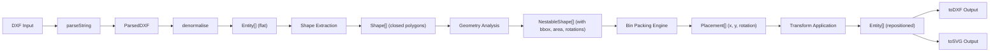

# Nesting Roadmap — DXF-Renewed

> **Nesting** (arranjo otimizado de peças em chapa) é a capacidade de extrair formas fechadas de um arquivo DXF e rearranjá-las dentro de uma área de material (chapa, placa, tecido, etc.) minimizando desperdício.

**Última atualização:** 2026-06-29  
**Status:** Todas as Fases Implementadas (0-5)  
**Responsável:** LiNkIeZ

---

## Visão Geral

### Objetivo

Adicionar ao DXF-Renewed um pipeline completo de nesting que:

1. **Extrai** formas fechadas (closed shapes) de arquivos DXF existentes.
2. **Computa** limites (bounding boxes, convex hulls) e propriedades geométricas de cada forma.
3. **Arranجا** (arranges) as formas dentro de uma ou mais chapas retangulares, minimizando desperdício.
4. **Gera** um novo arquivo DXF (ou SVG) com as posições rearranjadas, pronto para corte CNC/laser/waterjet.

### Não é objetivo (initialmente)

- Nesting 3D.
- Otimização multi-material ou multi-espessura.
- Interface gráfica completa (CLI + API programática primeiro).
- Suporte a curvas não-planas ou superfícies.

---

## Arquitetura de Alto Nível



---

## Fases de Implementação

### Fase 0 — Fundação e Tipos (Prioridade: Alta) ✅ Completa

**Objetivo:** Estabelecer a base de tipos, interfaces e estrutura de módulos para nesting.

**Arquivos a criar:**
- `src/nesting/` — diretório raiz do módulo de nesting
- `src/nesting/types.ts` — tipos fundamentais
- `src/nesting/config.ts` — opções e defaults
- `src/nesting/index.ts` — exports do módulo

**Tipos fundamentais:**

```typescript
/** Uma forma extraída do DXF, pronta para nesting */
interface NestableShape {
  id: string
  layer: string
  originalHandle?: string
  vertices: Point2D[]          // contorno fechado (primeiro = último)
  bbox: BoundingBox           // bounding box axis-aligned
  convexHull?: Point2D[]      // hull convexo (opcional, computado sob demanda)
  area: number                // área da forma
  perimeter: number           // perímetro
  centroid: Point2D           // centroide
  allowedRotations: number[]  // ângulos permitidos (graus)
  kerf: number                // largura de corte (compensação)
  tag?: string                // identificador do usuário
}

/** Resultado do placement de uma forma na chapa */
interface Placement {
  shapeId: string
  x: number                   // posição X na chapa
  y: number                   // posição Y na chapa
  rotation: number            // rotação aplicada (graus)
  bbox: BoundingBox           // bbox após transformação
}

/** Definição de uma chapa de material */
interface StockSheet {
  width: number
  height: number
  thickness?: number
  material?: string
  grainAngle?: number         // direção da fibra (para madeira/compositos)
}

/** Resultado completo do nesting */
interface NestingResult {
  placements: Placement[]
  sheets: StockSheet[]        // chapas utilizadas
  unplacedShapes: NestableShape[]  // formas que não caberam
  utilization: number         // % de utilização do material
  wasteArea: number           // área de desperdício
  totalArea: number           // área total das chapas
  shapesTotalArea: number     // área total das formas
}

/** Configuração do nesting */
interface NestingOptions {
  stockSheet: StockSheet | StockSheet[]
  algorithm: NestingAlgorithm
  allowedRotations: number[]  // [0, 90, 180, 270] por padrão
  kerf: number               // distância mínima entre formas (largura de corte)
  margin: number             // margem da borda da chapa
  sortBy: 'area' | 'perimeter' | 'none'  // ordenação das formas
  maxSheets?: number         // limite de chapas
  respectLayers?: boolean    // manter formas da mesma layer juntas
  respectGrain?: boolean     // respeitar direção da fibra
}

type NestingAlgorithm = 'guillotine' | 'bliss' | 'maxrects' | 'shelf'
```

**Critérios de aceitação:**
- [ ] Todos os tipos definidos em `src/nesting/types.ts`
- [ ] Config com valores padrão sensatos
- [ ] Tests de tipagem (`tsc --noEmit` passa)
- [ ] Exportado via `src/nesting/index.ts`

---

### Fase 1 — Extração de Formas Fechadas (Prioridade: Alta) ✅ Completa

**Objetivo:** Identificar e extrair formas fechadas (closed shapes) a partir das entidades DXF.

**Arquivos a criar:**
- `src/nesting/shapeExtractor.ts` — extrai formas de entidades
- `src/nesting/polygonUtils.ts` — utilitários de polígono
- `test/unit/nesting/shapeExtractor.test.ts`
- `test/unit/nesting/polygonUtils.test.ts`

**Funcionalidades:**

1. **Identificação de formas fechadas:**
   - `LWPOLYLINE` com flag 70 = 1 (closed)
   - `POLYLINE` com flag 70 = 1 (closed) terminada por `SEQEND`
   - `CIRCLE` → aproximado como polígono
   - `ELLIPSE` → aproximado como polígono
   - `SPLINE` fechada → aproximado como polígono
   - `SOLID` / `TRACE` → como polígono de 4 vértices
   - `ARC` completo (360°) → tratado como círculo

2. **Validação de polígonos:**
   - Verifica se o polígono é fechado (primeiro ≈ último vértice)
   - Detecta polígonos auto-intersectantes
   - Normaliza orientação (clockwise vs counter-clockwise)

3. **Aproximação de curvas:**
   - Arco de círculo → N segmentos lineares
   - Elipse → N segmentos lineares
   - Spline → interpolação com densidade configurável

4. **Hierarquia de formas:**
   - Formas externas vs buracos (inner contours)
   - Detecção de formas aninhadas (point-in-polygon)
   - Composição de `CompoundShape` (externa + buracos)

**Critérios de aceitação:**
- [ ] Extrai formas fechadas de LWPOLYLINE, POLYLINE, CIRCLE, ELLIPSE
- [ ] Aproxima curvas com densidade configurável
- [ ] Detecta e preserva buracos (inner contours)
- [ ] Tests com fixtures existentes (`test/resources/`)
- [ ] `test/resources/squareandcircle.dxf` → 2 shapes extraídos
- [ ] `test/resources/closedlwpolylinebug.dxf` → shape extraído

---

### Fase 2 — Análise Geométrica (Prioridade: Alta) ✅ Completa

**Objetivo:** Computar propriedades geométricas necessárias para o algoritmo de bin packing.

**Arquivos a criar:**
- `src/nesting/geometryAnalysis.ts` — análise geométrica
- `src/nesting/boundingBox.ts` — computação de bounding boxes
- `test/unit/nesting/geometryAnalysis.test.ts`
- `test/unit/nesting/boundingBox.test.ts`

**Funcionalidades:**

1. **Bounding Box (AABB — Axis-Aligned Bounding Box):**
   - Computação rápida para cada forma
   - Rotated Bounding Box (OBB — Oriented Bounding Box) para cada ângulo de rotação permitido

2. **Área e Perímetro:**
   - Área via fórmula do surveyor (shoelace formula)
   - Perímetro via soma de distâncias entre vértices
   - Área líquida (externa - buracos) para `CompoundShape`

3. **Centroide:**
   - Centroide do polígono para posicionamento inicial

4. **Convex Hull (opcional, sob demanda):**
   - Algoritmo de Monotone Chain (O(n log n))
   - Usado para碰撞检测 mais eficiente

5. **Orientação e Normalização:**
   - Normaliza polígono para counter-clockwise
   - Computa winding number para detectar interior/exterior

**Critérios de aceitação:**
- [ ] AABB computado para todas as formas
- [ ] OBB computado para ângulos de rotação permitidos
- [ ] Área e perímetro corretos (validado contra formas conhecidas)
- [ ] Centroide correto
- [ ] Convex hull opcional com lazy evaluation

---

### Fase 3 — Motor de Bin Packing (Prioridade: Crítica) ✅ Completa

**Objetivo:** Implementar algoritmos de 2D bin packing para arranjar as formas nas chapas.

**Arquivos a criar:**
- `src/nesting/binPacking/` — diretório do motor
- `src/nesting/binPacking/types.ts` — tipos internos
- `src/nesting/binPacking/guillotine.ts` — algoritmo Guillotine
- `src/nesting/binPacking/maxrects.ts` — algoritmo MaxRects
- `src/nesting/binPacking/shelf.ts` — algoritmo Shelf (FFD/HFD)
- `src/nesting/binPacking/placeholder.ts` — placement final
- `test/unit/nesting/binPacking/*.test.ts`

**Algoritmos a implementar (em ordem de prioridade):**

#### 3.1 Guillotine Split (Bliss / Good)

O algoritmo mais simples e eficiente para nesting industrial.

- Divide o espaço restante em retângulos após cada placement
- Suporta rotação de 90°
- Heurísticas: Shortest Side First (SSF), Shortest Side Fit (SSFit)
- Complexidade: O(n log n)

#### 3.2 MaxRects (Non-Guillotine)

Melhor utilização do espaço, mas mais complexo.

- Mantém lista de retângulos máximos disponíveis
- Seleciona o melhor retângulo para cada forma
- Suporta rotação arbitrária (via OBB)
- Complexidade: O(n²) no pior caso

#### 3.3 Shelf (First Fit / Next Fit Decreasing Height)

Simples, bom para formas retangulares.

- Organiza formas em "prateleiras" horizontais
- Ordena por área ou altura
- Útil como fallback ou para casos simples

**Interface comum:**

```typescript
interface BinPackingAlgorithm {
  name: NestingAlgorithm
  pack(
    shapes: NestableShape[],
    sheet: StockSheet,
    options: NestingOptions
  ): Placement[]
  supportsRotation: boolean
  supportsArbitraryAngles: boolean
}
```

**Critérios de aceitação:**
- [ ] Guillotine implementado e testado
- [ ] MaxRects implementado e testado
- [ ] Shelf implementado como fallback
- [ ] Suporte a rotação de 90° em todos os algoritmos
- [ ] Suporte a rotação arbitrária no MaxRects
- [ ] Kerf (distância entre formas) respeitado
- [ ] Margin (margem da chapa) respeitado
- [ ] Multi-sheet (formas que não cabem vão para chapa seguinte)

---

### Fase 4 — Colisão e Validação (Prioridade: Média) ✅ Completa

**Objetivo:** Garantir que formas não se sobrepõem após o nesting.

**Arquivos a criar:**
- `src/nesting/collision.ts` — detecção de colisão
- `test/unit/nesting/collision.test.ts`

**Funcionalidades:**

1. **Bounding Box Overlap (rápido):**
   - Verifica se AABBs se sobrepõem (reject rápido)

2. **Separating Axis Theorem (SAT):**
   - Para polígonos convexos
   - Verifica colisão exata entre formas rotacionadas

3. **Point-in-Polygon:**
   - Ray casting algorithm
   - Usado para validar buracos e formas aninhadas

4. **Validação pós-nesting:**
   - Verifica que nenhum placement se sobrepõe
   - Verifica que todos os placements estão dentro da chapa
   - Reporta erros com detalhes

**Critérios de aceitação:**
- [ ] SAT implementado para polígonos convexos
- [ ] Bounding box overlap como reject rápido
- [ ] Validação pós-nesting sem falsos positivos
- [ ] Tests com formas sobrepostas intencionalmente

---

### Fase 5 — Aplicação de Transformações e Output (Prioridade: Alta) ✅ Completa

**Objetivo:** Aplicar as transformações de nesting às entidades e gerar output.

**Arquivos a criar:**
- `src/nesting/applyNesting.ts` — aplica transformações
- `src/nesting/toNestedDxf.ts` — gera DXF com nesting
- `src/nesting/toNestedSvg.ts` — gera SVG com nesting
- `src/nesting/index.ts` — API pública consolidada
- `test/unit/nesting/applyNesting.test.ts`
- `test/functional/nesting-viewer.html`

**Funcionalidades:**

1. **Aplicação de transformações:**
   - Translação (x, y do placement)
   - Rotação (ângulo do placement)
   - Preserva hierarquia de formas compostas (externa + buracos)

2. **Geração de DXF:**
   - Cria novo DXF com entidades re-posicionadas
   - Preserva layers, cores, estilos
   - Adiciona layer de referência da chapa (stock outline)
   - Opção de incluir/excluir formas não colocadas

3. **Geração de SVG:**
   - SVG com formas rearranjadas
   - Overlay da chapa de material
   - Legend com métricas de utilização
   - Highlight de formas por layer/cor

4. **API pública:**

```typescript
/** API principal de nesting */
export async function nest(
  dxfContent: string,
  options: NestingOptions
): Promise<NestingResult>

/** Helper com nesting integrado */
export class NestingHelper extends Helper {
  nest(options: NestingOptions): Promise<NestingResult>
  toNestedDxf(options?: NestingOptions): Promise<string>
  toNestedSvg(options?: NestingOptions): Promise<string>
}
```

**Critérios de aceitação:**
- [ ] Transformações aplicadas corretamente a todas as entidades
- [ ] DXF output válido (parseável pelo próprio DXF-Renewed)
- [ ] SVG output com overlay da chapa e métricas
- [ ] Forms não colocadas reportadas em `unplacedShapes`
- [ ] Métricas de utilização calculadas corretamente

---

### Fase 6 — CLI e Interface de Linha de Comando (Prioridade: Média)

**Objetivo:** Adicionar comandos CLI para nesting.

**Arquivos a modificar/criar:**
- `src/cli.ts` — estender com comandos de nesting
- `test/integration/nesting-cli.integration.test.ts`

**Comandos:**

```bash
# Nesting básico
dxf-to-svg --nest --sheet-size 3000x2000 input.dxf output.svg

# Com opções avançadas
dxf-to-svg --nest \
  --sheet-size 3000x2000 \
  --algorithm maxrects \
  --rotations 0,90,180,270 \
  --kerf 2 \
  --margin 10 \
  --sort-by area \
  input.dxf output.dxf

# Preview com métricas
dxf-to-svg --nest --preview input.dxf

# Multi-sheet
dxf-to-svg --nest --max-sheets 3 input.dxf output.dxf
```

**Critérios de aceitação:**
- [ ] CLI `--nest` funcional
- [ ] `--sheet-size` parseado corretamente
- [ ] `--algorithm` seleciona algoritmo
- [ ] `--kerf` e `--margin` aplicados
- [ ] Output em DXF e SVG
- [ ] Métricas exibidas no console

---

### Fase 7 — Otimizações Avançadas (Prioridade: Baixa)

**Objetivo:** Melhorar qualidade do nesting com técnicas avançadas.

**Funcionalidades:**

1. **Kerning adaptativo:**
   - Distância variável entre formas baseado na orientação
   - Kerning mínimo baseado em bounding box rotacionado

2. **Nesting com restrições de grain:**
   - Para madeira e compósitos
   - Restringe rotação baseado no ângulo da fibra

3. **Common cuts (cortes compartilhados):**
   - Detecta bordas adjacentes e elimina corte duplicado
   - Reduz tempo de máquina e desgaste

4. **Lead-in/Lead-out points:**
   - Adiciona pontos de entrada para corte CNC
   - Configuração por material

5. **Heurísticas de ordenação avançadas:**
   - First Fit Decreasing (FFD) por área
   - Bin Completion (preencher gaps antes de abrir nova chapa)

6. **Paralelismo:**
   - Computação de OBB em paralelo
   - Bin packing multi-threaded (via Worker threads)

**Critérios de aceitação:**
- [ ] Common cuts detectados e reportados
- [ ] Grain constraints respeitados
- [ ] Performance: nesting de 1000+ formas em < 5s

---

### Fase 8 — Testes de Integração e Benchmarks (Prioridade: Média)

**Objetivo:** Validar nesting com DXFs reais e benchmarks.

**Arquivos a criar:**
- `test/integration/nesting-real-world.integration.test.ts`
- `test/integration-browser/nesting-rendering.browser.spec.ts`
- `test/resources/nesting/` — fixtures específicas para nesting
- `benchmarks/nesting.bench.ts`

**Fixtures para nesting:**

| Fixture | Descrição | Formas esperadas |
|---------|-----------|-----------------|
| `nesting-simple-squares.dxf` | 4 quadrados simples | 4 shapes |
| `nesting-complex-profiles.dxf` | Perfis de alumínio variados | 10-20 shapes |
| `nesting-with-holes.dxf` | Formas com buracos internos | 5 compound shapes |
| `nesting-circular-parts.dxf` | Peças circulares (porcas, anéis) | 8 shapes |
| `nesting-architectural.dxf` | Plano arquitetônico (stress test) | 50+ shapes |

**Benchmarks:**

- nesting de 10, 50, 100, 500, 1000 formas
- Comparação entre algoritmos (Guillotine vs MaxRects vs Shelf)
- Métricas de utilização por algoritmo

**Critérios de aceitação:**
- [ ] Todos os fixtures extraem formas corretamente
- [ ] Browser test renderiza SVG de nesting
- [ ] Benchmarks com < 5s para 1000 formas
- [ ] Utilização > 70% para casos simples

---

## Dependências Externas

### Recomendadas (evaluar)

| Biblioteca | Propósito | Licença | Status |
|-----------|-----------|---------|--------|
| `polyclip` | Boolean operations em polígonos | BSD | Evaluar |
| `clipper-lib` / `clipper-js` | Clip/unite/diff de polígonos | BSD | Evaluar |
| `2d-bin-pack` | Algoritmo de bin packing pronto | MIT | Evaluar (ou implementar próprio) |
| `convex-hull` | Convex hull computation | MIT | Evaluar |
| `rbush` | Spatial index (R-tree) | MIT | Para collision detection |

### Decisão inicial

**Fase 0-3:** Implementar algoritmos próprios (sem dependências externas).  
Motivo: controle total, menor footprint, learning.

**Fase 4+:** Avaliar `clipper-js` para boolean operations se necessário para kerning avançado e common cuts.

---

## Integração com API Existente

### Extensão do `Helper`

```typescript
import { Helper } from '@linkiez/dxf-renew'

const helper = new Helper(dxfString)

// Nesting integrado
const result = await helper.nest({
  stockSheet: { width: 3000, height: 2000 },
  algorithm: 'maxrects',
  kerf: 2,
  margin: 10,
  allowedRotations: [0, 90, 180, 270],
})

console.log(`Utilização: ${result.utilization.toFixed(1)}%`)
console.log(`Formas não colocadas: ${result.unplacedShapes.length}`)

// Output com nesting
const nestedSvg = helper.toNestedSvg()
const nestedDxf = helper.toNestedDxf()
```

### Extensão do CLI

```bash
# Usa nesting com defaults
dxf-to-svg --nest --sheet 3000x2000 input.dxf

# Customizado
dxf-to-svg --nest --sheet 3000x2000 --algo maxrects --kerf 2 input.dxf
```

---

## Checklist de Progresso

### Fase 0 — Fundação
- [x] `src/nesting/` criado
- [x] `src/nesting/types.ts` com todos os tipos
- [x] `src/nesting/config.ts` com defaults
- [x] `src/nesting/index.ts` com exports
- [x] `src/nesting/polygonUtils.ts` com utilitários geométricos
- [x] Tests de config (`test/unit/nesting/config.test.ts`)
- [x] Tests de polygonUtils (`test/unit/nesting/polygonUtils.test.ts`)
- [x] Tests de tipagem passando (`tsc --noEmit`)

### Fase 1 — Extração de Formas
- [x] `shapeExtractor.ts` identifica LWPOLYLINE fechado
- [x] `shapeExtractor.ts` identifica POLYLINE fechado
- [x] `shapeExtractor.ts` aproxima CIRCLE como polígono
- [x] `shapeExtractor.ts` aproxima ELLIPSE como polígono
- [x] `shapeExtractor.ts` extrai SOLID/TRACE como polígono
- [x] `shapeExtractor.ts` extrai ARC completo como círculo
- [x] `shapeExtractor.ts` extrai SPLINE fechada
- [x] Detecção de buracos (inner contours)
- [x] Tests com fixtures

### Fase 2 — Análise Geométrica
- [x] AABB para todas as formas
- [x] OBB para ângulos de rotação
- [x] Área e perímetro
- [x] Centroide
- [x] Convex hull (lazy)
- [x] Sorting strategies

### Fase 3 — Bin Packing
- [x] Guillotine algorithm
- [x] MaxRects algorithm
- [x] Shelf algorithm
- [x] Rotação de 90°
- [x] Kerf e margin
- [x] Multi-sheet support

### Fase 4 — Colisão
- [x] SAT collision detection
- [x] Bounding box overlap
- [x] Validação pós-nesting

### Fase 5 — Output
- [x] Transformação aplicada
- [x] DXF output válido
- [x] SVG output com overlay
- [x] API pública (`nest()`, `NestingHelper`)
- [x] Pipeline completo (`applyNesting.ts`)

### Fase 6 — CLI
- [ ] `--nest` flag
- [ ] `--sheet-size` option
- [ ] `--algorithm` option
- [ ] Métricas no console

### Fase 7 — Otimizações
- [ ] Common cuts
- [ ] Grain constraints
- [ ] Performance benchmarks

### Fase 8 — Integração
- [ ] Fixtures de nesting
- [ ] Browser integration tests
- [ ] Benchmarks

---

## Referências

### Algoritmos de Bin Packing

- **Guillotine:** Baker, B.S., Coffman, E.G., & Rivest, R.L. (1980). "Orthogonal Packings in Two Dimensions"
- **MaxRects:** J. V. Baptista et al., "Skyline structures for 2D rectangle packing"
- **Shelf (FFD/HFD):** Cormen et al., "Introduction to Algorithms" — bin packing chapter
- **Skyline:** Bischof, E., Martin, E., & Rietz, M. (1995). "A 2D packer for non-guillotine patterns"

### Implementações de Referência

- [bin-pack](https://github.com/jakesgordon/bin-pack) — JavaScript 2D bin packing
- [rect-packer](https://github.com/shana/rectpack) — MaxRects implementation
- [polyclip](https://github.com/ImageMagick/polyclip) — Polygon clipping library
- [Clipper Library](http://www.angusj.com/delphi/clipper.php) — Industry-standard polygon clipping

### Nesting Industrial

- [SigmaNEST](https://www.siganest.com/) — Referência comercial de nesting
- [BetaCAM](https://www.betacam.com/) — Another commercial nesting reference
- [AutoCAD Nesting](https://knowledge.autodesk.com/) — Autodesk nesting features

---

## Notas de Desenvolvimento

### Decisões de Design

1. **Polígonos como representação primária:** Todas as formas são convertidas para polígonos (array de vértices) para uniformidade no bin packing.

2. **Aproximação de curvas:** Círculos, elipses e splines são aproximados como polígonos com densidade configurável. A densidade padrão é suficiente para corte CNC (tolerância ~0.1mm).

3. **Kerf como parâmetro global:** A largura de corte (kerf) é aplicada uniformemente. Kerning adaptativo por par de formas é Fase 7.

4. **Sem dependências externas inicialmente:** O módulo de nesting é self-contained. Dependências externas só se justificarem em fases avançadas.

5. **Nesting é assíncrono:** A função `nest()` retorna uma `Promise` para não bloquear o event loop durante computações intensivas.

### Performance Targets

| Número de formas | Tempo máximo | Algoritmo |
|-----------------|-------------|-----------|
| 10 | < 100ms | Qualquer |
| 50 | < 500ms | Qualquer |
| 100 | < 1s | Guillotine/MaxRects |
| 500 | < 3s | Guillotine |
| 1000 | < 5s | Guillotine |
| 5000 | < 15s | Guillotine (parallel) |

### Compatibilidade

- Node.js >= 18 (mesmo requirement do DXF-Renewed)
- Browser (ES2020+)
- TypeScript strict mode

---

*Este roadmap é executável como sequência de PRs. Cada fase pode ser entregue independentemente e testada com fixtures existentes.*
