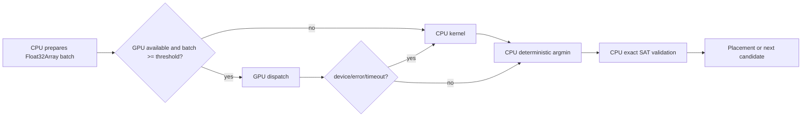

# GPU Acceleration (Auto-detect, CPU Fallback)

Companion detail doc for [`ROADMAP-NESTING.md`](../../ROADMAP-NESTING.md).

## Contract

GPU is an optional accelerator. CPU remains the reference implementation and final geometry
authority: it accepts placements, validates exact SAT overlap, sequences cuts and emits NC.
Absence, loss or failure of a GPU must never fail a nesting job.

```ts
export interface GpuOptions {
  acceleration: 'auto' | 'cpu' | 'gpu'
  gpuMinCandidates: number
  gpuEpsilon: number
  gpuTimeoutMs: number
}

export interface BackendReport {
  backendUsed: 'cpu' | 'gpu'
  fallbackReason?: 'no-adapter' | 'device-lost' | 'timeout' | 'shader-error'
    | 'below-threshold' | 'unsupported-op'
  gpuKernelMs: number
  transferMs: number
  cpuFinalizeMs: number
  speedup: number
}
```

`BackendReport` belongs in `NestingArtifact`. `auto` is the default; `gpu` means prefer GPU but
still falls back to CPU while returning its reason. Never silently claim a GPU result.

## Detection

| Environment | Probe | Result when unavailable |
|---|---|---|
| Browser | `navigator.gpu.requestAdapter()` | CPU fallback |
| Node.js | optional GPU backend package | CPU fallback |
| CI/headless | no adapter required | CPU baseline |

Probe once per process and cache capability only, not job data. WebGPU is a native browser
feature; no core package dependency is added. A Node GPU adapter is optional and must be loaded
dynamically.

## Eligible kernels

| Kernel | GPU role | CPU responsibility |
|---|---|---|
| SAT broad-phase batch | candidate AABB/intersection tests | exact polygon SAT verdict |
| NFP candidate scoring | score candidate x anchor matrix | stable argmin and tie-break |
| Rotation sweep | score many rotations concurrently | select angle and validate placement |
| Hull pre-filter | batch hull/AABB rejection | exact NFP for near-best candidates |

Placement acceptance, NFP construction, optimizer moves, cut sequencing, validation and NC
emission remain CPU-only. This avoids GPU floating-point differences changing production output.

## Dispatch flow



Buffers are preallocated per job and reused across dispatches. Input is flattened to typed arrays;
no object graph or per-candidate allocation crosses the GPU boundary.

## Numerical rules

- CPU geometry uses `number`/IEEE-754 f64; GPU kernels use f32 only for ranking and broad-phase.
- CPU tie-break is stable: score, then Y, X, angle and part id.
- GPU results within `gpuEpsilon` are tied and resolved by the CPU ordering rule.
- No unordered atomic reduction may decide a placement.
- `gpuEpsilon` defaults to `1e-4 mm`; exact CPU SAT decides any near-boundary candidate.

Same `(canonical input, seed, processor version, backend)` must serialize identically. CPU and GPU
runs must have the same valid placements or a documented score-equivalent layout; both must pass
CPU exact validation.

## Watchdog and observability

Each dispatch has `gpuTimeoutMs` (default `2000`). Device loss, shader compilation errors and
readback failures immediately retire the GPU backend for the current job, retry the same batch on
CPU, and populate `fallbackReason`. Metrics: `gpuKernelMs`, `transferMs`, `cpuFinalizeMs`,
`speedup`, candidate count, fallback count and backend selection.

## Benchmarks and gates

| Check | Requirement |
|---|---|
| Correctness | GPU output passes the same CPU SAT validation |
| Determinism | two equal GPU runs produce an equal serialized artifact |
| Cross-backend | equal placement or accepted score delta <= `gpuEpsilon` |
| Fallback | mocked device loss completes using CPU with a report reason |
| Benefit | enable GPU only above `gpuMinCandidates` and when measured speedup > 1 |

Use the fixtures in `docs/nesting/BENCHMARKS.md` when it is introduced. Do not make GPU a CI
requirement; CPU is the portable baseline.
