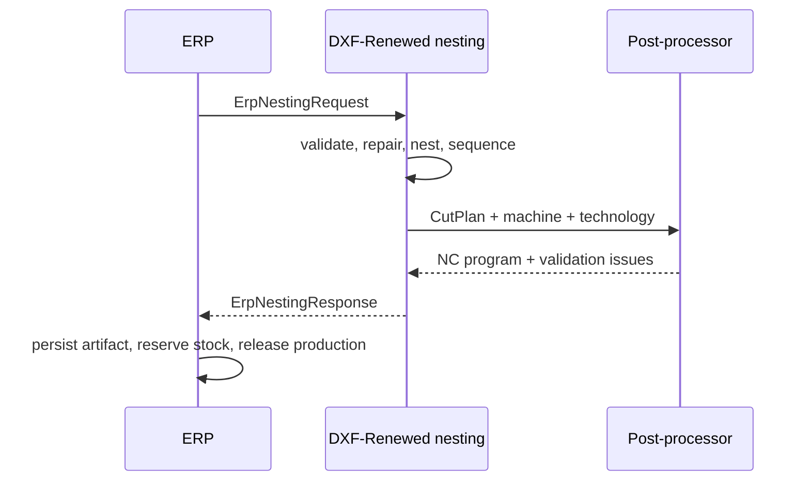

# Stateless Technology Profiles — Materials, Machine Presets, Lookup

Companion detail doc for [`ROADMAP-NESTING.md`](../../ROADMAP-NESTING.md) §11.
Documentation language: en_US (project rule).

Every number tied to a specific machine or power source is tagged **`[VERIFY]`** and must be
replaced by the value read from the machine manual before production use.

---

## 1. Purpose

`lookupProcessParams(machineKind, material, thickness) → ProcessParams` is the single source
of cutting parameters. The cut-path planner and every post-processor read from it; nothing
hard-codes a kerf, feed, pierce time or lead length.

```ts
export type MachineKind = 'laser' | 'plasma'

export interface ProcessParams {
  kerf: number                 // mm, cut width
  feed: number                 // mm/min, cutting feed
  rapidFeed: number            // mm/min, traverse
  pierce: PierceSpec
  leadIn: LeadSpec
  leadOut: LeadSpec
  gas?: string                 // 'O2' | 'N2' | 'air' | 'Ar/H2' ...
  power?: number               // laser, W or % (unit documented per DB)
  amperage?: number            // plasma, A
  thc?: boolean                // plasma torch height control
  notes?: string
}
```

Precedence (highest wins):

1. `Part.processOverrides`
2. explicit call argument
3. material preset row
4. machine default
5. library fallback (and emit a `warning`)

## Stateless contract

This module owns **no database, files, cache or job history**. The caller supplies a complete
`TechnologyProfileSet` to each `NestingJob`; the library returns a serializable artifact that
includes the resolved parameters and every warning. A host application may persist profiles,
remnants or artifacts elsewhere, but that is outside this package.

For ERP integration, the ERP is the system of record: it sends machine, material, stock sheets,
remnants, quantities and calibrated technology profiles as input. It receives the resulting
placements, selected machine/profile snapshot, cut plan, NC program, metrics, cost estimate and
validation issues as output. The nesting package never creates or updates ERP records.

```ts
export interface NestingJob {
  parts: Part[]
  sheets: StockSheet[]
  remnants?: Remnant[]
  technology: TechnologyProfileSet
  machine: Machine
}

export interface NestingArtifact {
  inputHash: string
  machine: Machine
  resolvedTechnology: ProcessParams
  result: NestingResult
  cutPlan: CutPlan
  ncProgram?: string
  report: JobReport
  issues: ValidationIssue[]
}
```

`inputHash` covers canonical job input plus the selected processor version. Identical inputs
and seed must produce byte-identical geometry and NC output.

### ERP request/response boundary

```ts
export interface ErpNestingRequest {
  jobId: string
  revision: string
  machine: Machine
  technology: TechnologyProfileSet
  sheets: StockSheet[]
  remnants?: Remnant[]
  parts: Part[]
  options?: NestingOptions
}

export interface ErpNestingResponse extends NestingArtifact {
  jobId: string
  revision: string
  processor: { id: string; version: string }
  processedAt: string
}
```

The response echoes `jobId` and `revision` only for correlation; it does not look them up or
persist them. The ERP chooses the post-processor through `machine.postProcessorId`.

### ERP identifiers and ownership

All identifiers are opaque ERP values. The nesting module carries them through the artifact but
does not validate their existence against an ERP endpoint or database.

| Field | Owner | Meaning |
|---|---|---|
| `jobId` | ERP | Production order or nesting request identifier |
| `revision` | ERP | Immutable revision of the source order |
| `part.id` | ERP | Part master or order-line identifier |
| `sheet.id` | ERP | Stock, reservation or remnant identifier |
| `machine.id` | ERP | Selected physical machine identifier |
| `technology.id` | ERP | Calibrated process-profile version identifier |
| `postProcessorId` | ERP machine profile | Selected NC dialect key |

The ERP decides whether a response supersedes a prior revision. The nesting engine only
guarantees that equal canonical inputs, seed and processor version yield an equal artifact.

### Expanded request model

```ts
export interface ErpPart extends Part {
  source: {
    drawingId: string
    drawingRevision: string
    /** DXF layer, block or entity source used for traceability */
    sourceRef?: string
  }
  quantity: number
  dueDate?: string
  priority: number
  processOverrides?: Partial<ProcessParams>
}

export interface ErpStockSheet extends StockSheet {
  id: string
  kind: 'full-sheet' | 'remnant'
  materialId: string
  materialName: string
  thickness: number
  available: boolean
  reservedForJobId?: string
  grainAngle?: number
  /** Existing irregular boundary when kind is remnant */
  outline?: Point2D[]
}

export interface ErpNestingOptions extends NestingOptions {
  seed: number
  objective: {
    materialYield: number
    machineTime: number
    sheetCount: number
    remnantPreference: number
  }
  stockPolicy: {
    useRemnantsFirst: boolean
    allowNewSheets: boolean
    minUsableRemnantArea: number
  }
  output: {
    includeNcProgram: boolean
    includeCutPlan: boolean
    includePreviewSvg: boolean
    includeThreeJsData: boolean
  }
}

export interface ErpNestingRequest {
  jobId: string
  revision: string
  requestedAt: string
  machine: Machine
  technology: TechnologyProfileSet
  sheets: ErpStockSheet[]
  parts: ErpPart[]
  options: ErpNestingOptions
}
```

### Expanded response model

```ts
export interface ErpNestingResponse extends NestingArtifact {
  jobId: string
  revision: string
  processedAt: string
  processor: { id: string; version: string }
  summary: {
    status: 'completed' | 'completed-with-warnings' | 'rejected'
    placedPartCount: number
    unplacedPartCount: number
    sheetCount: number
    utilizationPercent: number
    estimatedCutSeconds: number
  }
  placements: Array<Placement & { sheetId: string; partId: string }>
  unplaced: Array<{ partId: string; quantity: number; reason: UnplacedReason }>
  generated: {
    ncProgram?: { fileName: string; content: string; sha256: string }
    previewSvg?: string
    viewerData?: ViewerInput
  }
}

export type UnplacedReason =
  | 'NO_COMPATIBLE_STOCK'
  | 'PART_EXCEEDS_MACHINE_BOUNDS'
  | 'PART_EXCEEDS_SHEET_BOUNDS'
  | 'OPEN_OR_INVALID_CONTOUR'
  | 'TECHNOLOGY_PROFILE_MISSING'
  | 'NESTING_TIME_BUDGET_EXCEEDED'
```

`status: 'rejected'` means no NC program is emitted. A completed response can include warnings,
but `generated.ncProgram` is present only when no validation issue has `severity: 'error'`.

### Validation and idempotency rules

| Rule | Outcome |
|---|---|
| `jobId`, `revision`, machine and at least one stock sheet absent | reject request |
| part material/thickness differs from selected stock | `NO_COMPATIBLE_STOCK` |
| selected machine cannot fit a stock sheet | reject request |
| invalid, open or self-unrepairable contour | unplaced part with explicit reason |
| profile is uncalibrated (`null`) | warning; block NC output unless caller allows it |
| no valid placement before time budget | return valid partial artifact with unplaced parts |
| same canonical request + seed + processor version | byte-identical result |
| same `jobId` with another `revision` | independent calculation; no implicit replacement |

Canonical input excludes `requestedAt` and other correlation-only metadata from `inputHash`.
The response's `sha256` lets the ERP detect accidental NC changes before releasing production.

### ERP execution flow



The final ERP step is deliberately outside the library boundary. The nesting calculation remains
pure and can be retried, queued or run in parallel without distributed locking.

### Minimal request example

```json
{
  "jobId": "SO-10428",
  "revision": "3",
  "requestedAt": "2026-09-11T12:00:00Z",
  "machine": { "id": "LASER-01", "kind": "laser", "postProcessorId": "laser-generic" },
  "technology": { "id": "fiber-steel-v4", "profiles": [] },
  "sheets": [{ "id": "STK-44", "kind": "full-sheet", "width": 3000, "height": 1500,
    "materialId": "STEEL-A36", "materialName": "mild-steel", "thickness": 3, "available": true }],
  "parts": [{ "id": "PART-018", "quantity": 12, "priority": 100,
    "source": { "drawingId": "DXF-618", "drawingRevision": "7" }, "contours": [] }],
  "options": { "seed": 42, "objective": { "materialYield": 1, "machineTime": 0.3,
    "sheetCount": 0.5, "remnantPreference": 0.2 }, "stockPolicy": { "useRemnantsFirst": true,
    "allowNewSheets": true, "minUsableRemnantArea": 10000 }, "output": { "includeNcProgram": true,
    "includeCutPlan": true, "includePreviewSvg": false, "includeThreeJsData": true } }
}
```

---

## 2. Laser material table (seed — `[VERIFY]` all rows)

Columns: material, thickness (mm), kerf (mm), feed (mm/min), gas, pierce (ms), pierce height (mm).

| Material | Thk | Kerf | Feed | Gas | Pierce | Notes |
|---|---|---|---|---|---|---|
| mild-steel | 1 | `[VERIFY]` | `[VERIFY]` | O2 | `[VERIFY]` | |
| mild-steel | 3 | `[VERIFY]` | `[VERIFY]` | O2 | `[VERIFY]` | |
| mild-steel | 6 | `[VERIFY]` | `[VERIFY]` | O2 | `[VERIFY]` | |
| mild-steel | 10 | `[VERIFY]` | `[VERIFY]` | O2 | `[VERIFY]` | |
| stainless | 2 | `[VERIFY]` | `[VERIFY]` | N2 | `[VERIFY]` | high-pressure N2 |
| stainless | 5 | `[VERIFY]` | `[VERIFY]` | N2 | `[VERIFY]` | |
| alu | 2 | `[VERIFY]` | `[VERIFY]` | N2/air | `[VERIFY]` | |
| alu | 5 | `[VERIFY]` | `[VERIFY]` | N2/air | `[VERIFY]` | |

Do not ship guessed rows. Populate from the laser's own cut database (BySoft, TruTops, etc.)
or the manufacturer's parameter tables, then delete the `[VERIFY]` tags.

---

## 3. Plasma material table (seed — `[VERIFY]` all rows)

Columns: material, thickness (mm), kerf (mm), feed (mm/min), amperage (A), pierce delay (ms),
pierce height (mm), THC.

| Material | Thk | Kerf | Feed | Amps | Pierce | Height | THC |
|---|---|---|---|---|---|---|---|
| mild-steel | 3 | `[VERIFY]` | `[VERIFY]` | `[VERIFY]` | `[VERIFY]` | `[VERIFY]` | on |
| mild-steel | 6 | `[VERIFY]` | `[VERIFY]` | `[VERIFY]` | `[VERIFY]` | `[VERIFY]` | on |
| mild-steel | 12 | `[VERIFY]` | `[VERIFY]` | `[VERIFY]` | `[VERIFY]` | `[VERIFY]` | on |
| stainless | 6 | `[VERIFY]` | `[VERIFY]` | `[VERIFY]` | `[VERIFY]` | `[VERIFY]` | on |
| alu | 6 | `[VERIFY]` | `[VERIFY]` | `[VERIFY]` | `[VERIFY]` | `[VERIFY]` | on |

Source of truth for plasma: the power source's own cut chart (Hypertherm, Thermal Dynamics,
etc.). The DB stores the chart; it does not invent it.

---

## 4. Pierce specification

```ts
export interface PierceSpec {
  /** plasma: dwell after arc established, ms */
  dwellMs: number
  /** plasma: initial pierce height, mm */
  heightMm?: number
  /** spot vs. continuous pierce mode */
  mode?: 'spot' | 'continuous'
  /** minimum time before motion is allowed, ms */
  delayMs: number
}
```

Rules:
- Thicker material → longer pierce time and higher pierce height.
- Always pierce at the pierce height, then descend to cut height before `G01`.
- Pierce delay must complete before the first `cut` action — validator enforces this.

---

## 5. Lead defaults

| Thickness class | Lead-in type | Length rule |
|---|---|---|
| thin (< 3 mm) | line | longer relative to part, ≥ `2 × kerf` |
| medium (3–8 mm) | line or arc | ≈ `1.5 × thickness`, clamped |
| thick (> 8 mm) | arc or ramp | radius ≥ `thickness`, avoid square corners |

Ramp lead-in is preferred for plasma on thick plate (reduces dross and blow-through).

---

## 6. Machine profiles

```ts
export interface Machine {
  id: string
  kind: MachineKind
  name: string
  postProcessorId: string
  maxSheet: { width: number; height: number }
  rapidFeed: number            // mm/min
  maxFeed: number              // mm/min
  units: 'mm' | 'inch'
  arcSupport: boolean          // native G02/G03
  hasTHC: boolean              // plasma
  hasZAxis: boolean
  headCount: number            // 1 = single, 2 = dual gantry [VERIFY]
  acceleration?: number        // mm/s², for corner slowdown [VERIFY]
}
```

Machine profiles are supplied by the caller (for example, loaded from its own versioned JSON).
The library does not read `data/machines` or persist machine data. A profile with `headCount > 1`
requires the post-processor to emit head offsets **`[VERIFY]`** per machine.

---

## 7. Seed data format

Provide a JSON profile example the calling application can version and edit without touching code:

```json
{
  "$schema": "./technology.schema.json",
  "version": 1,
  "materials": [
    {
      "machineKind": "laser",
      "material": "mild-steel",
      "thickness": 3,
      "kerf": null,
      "feed": null,
      "gas": "O2",
      "pierce": { "dwellMs": null, "delayMs": null },
      "leads": { "type": "line", "length": null, "angle": 45 },
      "_verify": ["kerf", "feed", "pierce"]
    }
  ]
}
```

`null` means "not yet calibrated": the lookup returns the value but flags a `warning`, and
the validator surfaces it. This makes missing calibration visible instead of silently wrong.
The package neither stores nor mutates the supplied JSON.

---

## 8. Lookup contract

```ts
export function lookupProcessParams(
  machineKind: MachineKind, material: string, thickness: number,
): { params: ProcessParams; issues: ValidationIssue[] }
```

- Nearest thickness row if no exact match (log which row was chosen).
- Unknown material → library fallback + `warning` `UNKNOWN_MATERIAL`.
- Any `null`/`_verify` field → `warning` `PARAM_NOT_CALIBRATED` naming the field.

---

## 9. `[VERIFY]` checklist

1. Laser cut database per material/thickness (kerf, feed, gas, pierce).
2. Plasma cut chart per power source (amperage, feed, kerf, pierce, height).
3. THC enable logic and safe rapid height.
4. Machine acceleration for corner slowdown.
5. Dual-head offsets, if applicable.
6. Native arc support per machine.
7. Units printed on the machine controller (mm vs. inch default).
8. Consumable life figures for costing.
