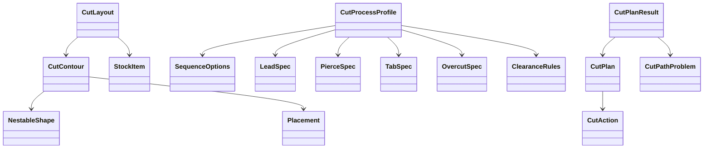

# Tipos de domínio de cut-path

## Visão geral

`types.ts` define o modelo público e independente de máquina para planejamento de trajetórias de
corte. Os tipos reutilizam a geometria existente do módulo de nesting e representam entradas de
layout, regras de processo, ações, métricas e problemas de validação.

## Responsabilidades

- Modelar contornos associados a peças e chapas.
- Descrever regras determinísticas de sequência, entrada, furação, tabs, overcut e clearances.
- Representar ações ordenadas sem comandos específicos de fabricante.
- Transportar métricas e problemas estruturados no resultado do planejador.

## Entradas e saídas

- Entradas: `CutLayout` e `CutProcessProfile`.
- Saídas: `CutPlan`, `CutPlanResult`, planos por folha e seus tipos auxiliares.
- Geometria: `Point2D`, `NestableShape`, `Placement` e `StockItem` de `src/nesting/types.ts`.

## Fluxo principal



## Tratamento de erros e casos-limite

Os tipos distinguem problemas esperados de validação por `code` e `severity`. Entradas
estruturalmente inválidas devem ser rejeitadas pela implementação do planejador; este arquivo não
executa validação nem altera objetos recebidos.

## Exemplos

```ts
const layout: CutLayout = {
  sheets: [{ id: 'sheet-1', kind: 'sheet', width: 100, height: 100 }],
  contours: [],
}
```

## Dependências e integrações

- `../types.ts` para entidades geométricas e chapas.
- O planejador, a geometria e a validação serão adicionados em módulos separados sem ampliar o
  escopo deste modelo.
